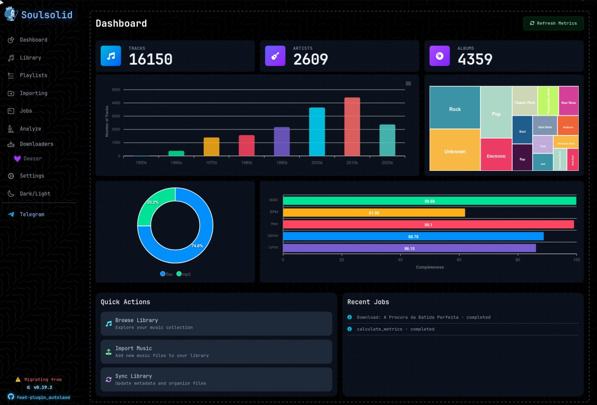
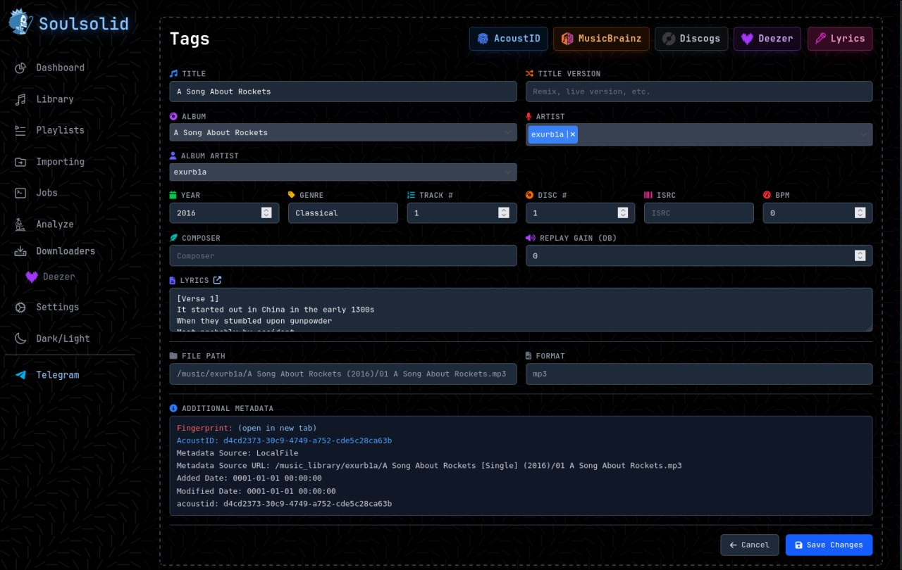

>
  <tr>
    <td></td>
    <td><h1>Soulsolid</h1></td>
  </tr>
</table>

[](https://discord.gg/mHRjGAjEJz)

A work in progress, feature rich music organization app built for the music hoarder. Heavily under development, focused on ease of usage and start up.

## Screenshots
<table>
  <tr>
    <td>
      
    </td>
    <td>
      
    </td>
  </tr>
</table>

## Features
- **Music Library Management**: Organize and browse albums, artists, and tracks
- **Downloading**: Download tracks and albums. 
- **Importing**: Import music from directories with automatic fingerprinting
- **Metadata Tagging**: Auto-tag using MusicBrainz and Discogs APIs
- **Sync with DAP**: Sync library with digital audio players
- **Telegram Integration**: Control via Telegram bot
- **Web UI**: Mobile-friendly interface for all operations 
- **Job Management**: Background processing for downloads, imports, and syncs

Documentation: https://soulsolid.contre.io
Demo: https://soulsolid-demo.contre.io


## Quick Start

### 🦭 Container Usage

The application can run without copying `config.yaml` into the container. If no config file exists, it will automatically create one with sensible defaults. 

#### Environment Variable Support

Soulsolid supports environment variables in configuration files using the `!env_var` tag:

```yaml
telegram:
  token: !env_var TELEGRAM_BOT_TOKEN
metadata:
  providers:
    discogs:
      secret: !env_var DISCOGS_API_KEY
```

The application will fail to start if a referenced environment variable is not set.

```bash
# Build the image
podman build -t soulsolid .

# Run with environment variables
podman run -d \
  --name soulsolid \
  -p 3535:3535 \
  -v /host/music:/app/library \
  -v /host/downloads:/app/downloads \
  -v /host/logs:/app/logs \ # optional
  -v /host/library.db:/data/library.db \
  -v /host/config.yaml:/config/config.yaml \
  soulsolid
```

Optionally, to hide secrets, you can `!env_var` syntax in anywhere in you `config.yaml`:
```yaml
telegram:
  token: !env_var TELEGRAM_BOT_TOKEN
metadata:
  providers:
    discogs:
      secret: !env_var DISCOGS_API_KEY
```

The web interface will be available at `http://localhost:3535`.

## Development

To set up the development environment:

### Option 1: Manual Setup

```bash
cp config.example.yaml config.yaml
npm run dev
go run ./src/main.go
```

### Option 2: Using Nix (recommended if you have Nix)

If you have Nix installed, use the provided dev.nix shell:

```bash
# Set up all dependencies (Node.js, Go, etc.) and run the necessary commands
nix-shell dev.nix
# Then, simply run:
go run ./src/main.go
```
The web interface will be available at `http://localhost:3535`.
