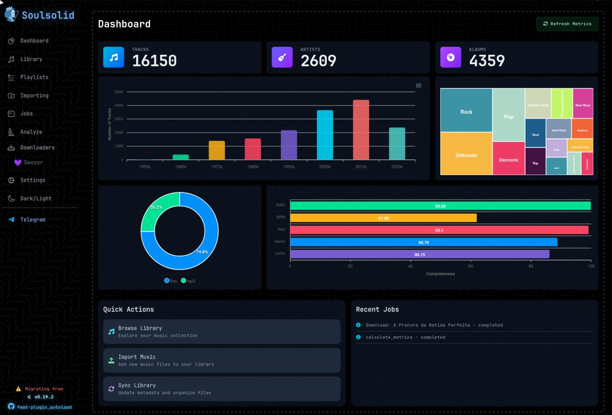
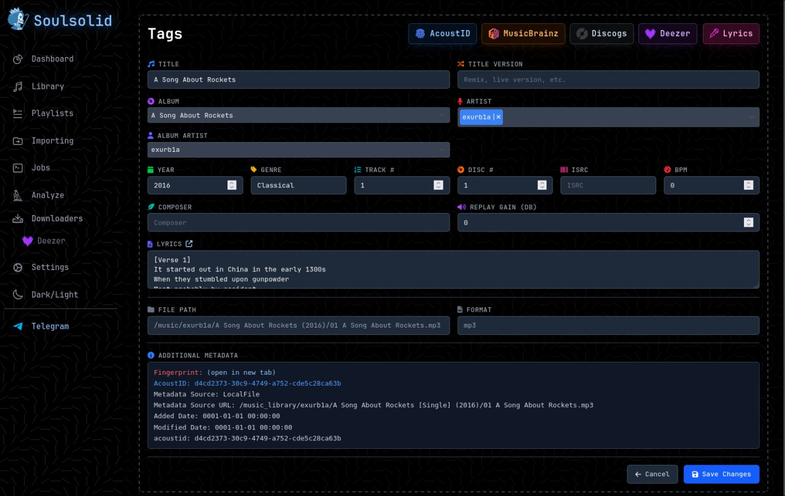

>
  <tr>
    <td></td>
    <td><h1>Soulsolid</h1></td>
  </tr>
</table>

[](https://discord.gg/mHRjGAjEJz)

A work in progress, feature rich music organization app built for the music hoarder. Heavily under development, focused on ease of usage and start up. Feel free to check the [docs](https://soulsolid.contre.io) or [demo](https://soulsolid-demo.contre.io)

See the [deepwiki](https://deepwiki.com/contre95/soulsolid)

## Screenshots
<table>
  <tr>
    <td>
      
    </td>
    <td>
      
    </td>
  </tr>
</table>

## Features
- **Music Library Management**: Organize and browse albums, artists, and tracks
- **Downloading**: Download tracks and albums. 
- **Importing**: Import music from directories with automatic fingerprinting
- **Metadata Tagging**: Auto-tag using MusicBrainz and Discogs APIs
- **Telegram Integration**: Control via Telegram bot
- **Web UI**: Mobile-friendly interface for all operations 
- **Job Management**: Background processing for downloads, imports, and synced lyrics and more. 

Documentation: https://soulsolid.contre.io
Demo: https://soulsolid-demo.contre.io


## Quick Start

### 🦭 Container Usage

The application can run without copying `config.yaml` into the container. If no config file exists, it will automatically create one with sensible defaults. 

### Environment Variable Support

Soulsolid supports environment variables in configuration files using the `!env_var` tag:

```yaml
telegram:
  token: !env_var TELEGRAM_BOT_TOKEN
metadata:
  providers:
    discogs:
      secret: !env_var DISCOGS_API_KEY
```

The application will fail to start if a referenced environment variable is not set.

### Build and/or run it  

```bash
# Build the image
podman build -t soulsolid .
# Create folders
mkdir downloads logs data confg
# Run with docker/podman
podman run -d --name soulsolid -p 3535:3535 \
  -v ./music:/app/library \
  -v ./downloads:/app/downloads \
  -v ./logs:/app/logs \
  -v ./data:/data/ \
  -v ./config:/config contre95/soulsolid:v0.22.1
```

The web interface will be available at `http://localhost:3535`.

## Development

To set up the development environment:

### Option 1: Manual Setup

```bash
cp config.example.yaml config.yaml
npm run dev
go run ./src/main.go
```

### Option 2: Using devenv (recommended)

If you have [devenv](https://devenv.sh) installed, it provides every dependency
(Go, Node.js 24, TailwindCSS, chromaprint, flac, id3v2, tree). On entering the
shell it runs `npm install`, builds the frontend assets, and exports
`SOULSOLID_CONFIG_PATH=./config.yaml`:

```bash
# Create your config once (devenv sets the path but doesn't create the file):
cp config.example.yaml config.yaml
# Enter the dev shell (installs npm deps + builds assets automatically):
devenv shell
# Then run the app:
go run ./src/main.go
```

Or start everything (asset build + server) in one command:

```bash
devenv up
```

To activate the environment automatically when you `cd` into the project,
install [direnv](https://direnv.net/), add `use devenv` to a `.envrc`, and run
`direnv allow` once.

The web interface will be available at `http://localhost:3535`.
