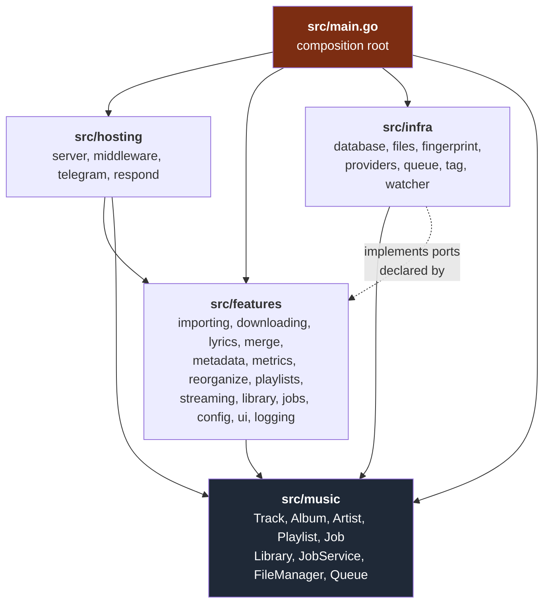
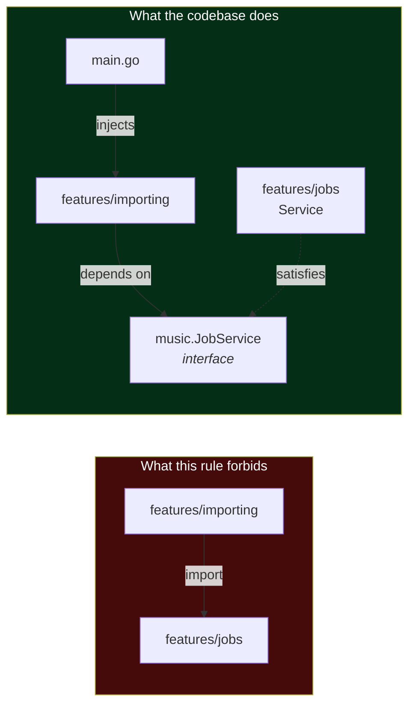
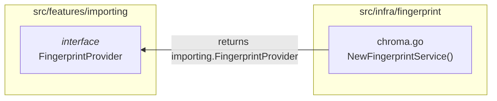

# 2. Vertical Slice Architecture

- **Status:** Accepted
- **Date:** 2026-08-24
- **Deciders:** contre95 (maintainer)
- **Supersedes:** —
- **Superseded by:** —

## Context

Soulsolid is a single-binary monolith with an unusually wide domain for its
size: importing, downloading, tagging, lyrics, playlists, streaming, metrics,
reorganizing, merging, and a Telegram control surface. Roughly 20,000 lines of
Go across ~100 files, maintained by one person.

The default Go layout for an app this size is layered — `handlers/`,
`services/`, `repositories/` — where each folder holds one horizontal stratum of
every feature. Soulsolid does the opposite: it packages by feature, not by
layer. Each feature owns its HTTP handlers, its business logic, its background
job and its Telegram commands, side by side in one folder.

The reasoning is that **these features do not share a lifecycle.** They solve
different problems, they change for different reasons, and their changes are
driven by different concerns. Lyrics fetching and FAT32 path sanitizing have
nothing to do with each other and should not be forced to live in the same
`services/` folder just because they are both "services". Packaging by feature
keeps a change local: a lyrics change touches `src/features/lyrics/` and
nothing else.

It also anticipates growth. If any of these ever needs to be extracted, the
seam already exists — provided features never reach into one another directly.
That constraint is what makes the rest of this ADR necessary: if features are
allowed to import each other, the vertical slices silently fuse into a
distributed ball of mud and the layout becomes decoration.

## Decision Drivers

- **Change locality.** One conceptual change should touch one folder.
- **Independent lifecycles.** Features solve different problems and evolve at
  different rates, driven by different concerns.
- **Deletability.** A feature should be removable or disableable largely on its
  own.
- **Navigability for a solo maintainer.** Hold one feature in your head without
  loading the whole application.
- **Explicit contracts.** Where features *must* interact, the dependency should
  be visible and named, not implicit.
- **Extractability.** Keep the seams intact in case a feature ever moves out.

## Decision

### 1. Four layers, with a strict inward dependency rule

```
src/music/     core domain — entities + cross-feature contracts
src/features/  application logic, one folder per vertical slice
src/infra/     adapters implementing the ports features declare
src/hosting/   delivery (HTTP + Telegram) and composition
src/main.go    the composition root
```



`src/music` is the only package with no internal dependencies at all — verified
by `go list -deps ./src/music`, which returns nothing but itself. Everything
points inward toward it.

The dotted arrow is the important one and is explained in decision 4.

### 2. Features never import each other; contracts live in the core domain

This is the rule that makes the slices real rather than cosmetic. When one
feature needs a capability another provides, it does **not** import that
feature. It depends on an interface declared in `src/music`, and the composition
root injects the concrete implementation.

`src/music/services.go` is where those cross-feature contracts live:
`JobService`, `MetadataService`, `LyricsService`. Six features start background
work through `music.JobService`; none of them imports `src/features/jobs`.



Go's implicit interface satisfaction is what makes this cost-free: `jobs.Service`
satisfies `music.JobService` without importing anything, and the assertion
`var _ music.JobService = (*Service)(nil)` keeps it honest at compile time.

**The one sanctioned exception is `config`.** `*config.Manager` is imported
directly by 23 files — spanning 12 of the 14 feature packages, plus `hosting`,
four `infra` packages and `main.go` — and is never hidden behind an interface.
This is deliberate
— configuration is genuinely global, and wrapping it in a per-feature port would
be ceremony with no payoff. It is a shared kernel, treated as part of the
platform rather than as a peer feature. (It does have a cost; see Open
Questions.)

### 3. Two kinds of port, chosen by breadth of use

Interfaces are declared in one of two places, and the rule is how many features
consume them:

| | Where declared | Examples |
|---|---|---|
| **Cross-feature contracts** | `src/music` | `Library`, `JobService`, `FileManager`, `Queue`, `PlaylistRepository`, `MetadataService`, `LyricsService` |
| **Single-feature ports** | inside the consuming feature | `merge.Library`, `merge.TagReader`, `importing.PathParser`, `importing.FingerprintProvider`, `metadata.MetadataProvider`, `lyrics.LyricsProvider`, `downloading.Downloader`, `metrics.LibraryMetrics`, `reorganize.PathSanitizer` |

Narrow ports stay consumer-side and are deliberately minimal. `merge` declares
its own `Library` interface rather than consuming `music.Library` wholesale,
with the comment: *"the subset of the library repository the merge feature
needs… defined here so the feature depends only on what it uses."* That is the
intended pattern for anything one feature needs.

`src/music` is reserved for contracts that genuinely cross feature boundaries.
Putting everything there would turn the core domain into a dumping ground;
putting nothing there would force features to import each other.

### 4. Adapters point inward — `infra` imports `features`, not the reverse

Six of seven `infra` subpackages import a `features` package. This looks
backwards but is the correct direction for consumer-side ports: the *adapter*
imports the interface it satisfies, so the arrow still points inward.



The rule is **interfaces only**. An adapter may import a feature to name the
port it implements; it must never depend on a feature's concrete types. When it
does, the layering inverts for real — see decision 6.

The alternative, structural satisfaction with no import at all, is used wherever
the types allow it. Every job task satisfies `jobs.Task[P]` without importing
`src/features/jobs`, and `infra/files.PathSanitizer` satisfies
`reorganize.PathSanitizer` the same way.

### 5. A conventional shape inside every feature folder

Feature folders follow a documented convention, so any feature can be navigated
without reading it first:

| File | Responsibility |
|---|---|
| `service.go` | business logic; the type other layers are injected with |
| `handlers.go` | HTTP handlers, returning partials or JSON via `hosting/respond` |
| `routes.go` | `RegisterRoutes(app *fiber.App, …)` — the feature's URL surface |
| `telegram.go` | Telegram command handlers (only where the feature has any) |
| `*_job.go` | the background `Task` implementation (see ADR 0003) |
| other | feature-owned ports and domain helpers |

Constructors are uniform: `NewService`, `NewHandler`, `RegisterRoutes`,
`NewTelegramHandler`, `New<X>JobTask`.

Known deviations, recorded rather than rationalized: `config` names its service
`Manager` in `manager.go`; `reorganize/job.go` does not follow the `*_job.go`
suffix; `ui` is handler-only; `logging` is a single file with no HTTP surface.

### 6. `hosting` is the delivery layer, not a feature

`src/hosting/` builds the Fiber app, registers middleware and the template
engine, aggregates Telegram command handlers, and calls every feature's
`RegisterRoutes`. It imports 13 feature packages — it is the one place allowed
to know about all of them, which is precisely what keeps those 13 ignorant of
each other.

It lives at `src/hosting/`, a sibling of `features/`, `infra/` and `music/`,
rather than under `src/features/`, because it is not a slice: it sits *above*
them all. Its former location made two unrelated things look alike, since
`hosting/respond` is the opposite — a leaf HTTP helper imported *by* twelve
features' `handlers.go`, with no internal dependencies of its own. One package
sits at the top of the graph, the other at the bottom; nesting the second inside
the first made every feature's import of `respond` read like feature-to-feature
coupling.

### 7. `main.go` is the composition root: manual wiring, no container

All 215 lines of `src/main.go` are hand-written constructor injection. No DI
framework, no code generation, no reflection.

This is the deliberately "dirtiest" component in the Clean Architecture sense —
the one place that knows how everything fits together, so nothing else has to.
It reads top to bottom as the application's actual object graph: config →
logging → file layer → database → core services → adapters → provider-backed
services → job handler registration → Telegram → HTTP → shutdown.

The benefits are that the entire graph is greppable in one file, wiring mistakes
are compile errors rather than runtime surprises, and there is no framework
magic to debug. The cost is verbosity: `hosting.NewServer` takes twelve
positional service arguments, and `importing.NewService` takes eight.

## Alternatives Considered

| Alternative | Why not |
| --- | --- |
| **Layered packages (`handlers/`, `services/`, `repositories/`)** | The conventional Go layout, and better if the domain were narrow. Rejected because a single feature change would touch four folders, and because it groups code by technical role rather than by the reason it changes. |
| **Flat `internal/` with no sub-structure** | Fine at a few thousand lines. At 20k with 14 features it offers no navigation aid and no boundary to enforce. |
| **True modules (separate Go modules per feature)** | Would enforce boundaries mechanically rather than by discipline, but imposes multi-module versioning overhead on a solo project shipping one binary. The current layout preserves the seam without paying that cost. |
| **All interfaces in `src/music`** | One obvious place to look, but the core domain becomes a dumping ground of narrow single-consumer ports, and every feature ends up depending on declarations it does not use. |
| **All interfaces consumer-side, none in `music`** | The strict Go idiom. Rejected because cross-cutting contracts like `JobService` would then be duplicated in six features, and there would be no single place that documents how features are permitted to interact. |
| **DI container (wire, fx, dig)** | Would shorten `main.go`, but trades compile-time clarity for generated or reflective wiring — poor value when there is exactly one composition root and one binary. |
| **`hosting` kept under `src/features/`** | Status quo before this ADR. Rejected: it is not a slice, and co-locating the top-of-graph aggregator with the bottom-of-graph `respond` helper made the dependency graph misread. |

## Consequences

### Positive

- A feature change is a one-folder change. Adding a job, a route and a handler
  for the same capability happens in one place.
- The dependency rules are mechanically checkable, not aspirational. Three
  greps verify the whole architecture:
  ```bash
  go list -deps ./src/music | grep soulsolid | grep -v 'src/music$'   # must be empty
  rg '"github.com/contre95/soulsolid/src/infra' src/features/          # must be empty
  rg '"github.com/contre95/soulsolid/src/features/' src/features/      # only config
  ```
- Features are testable in isolation in principle: every external dependency
  arrives through an interface the feature itself declares.
- `src/music` doubles as documentation. Reading `services.go` tells you exactly
  which capabilities cross feature boundaries.
- Extracting a feature later is a mechanical exercise, because its inbound and
  outbound contracts are already named.

### Negative / accepted costs

- **The rules are conventions, not compiler-enforced.** Nothing prevents a
  feature-to-feature import except review. Two such edges were introduced and
  removed during the work that produced this ADR.
- **`config` is a genuine shared kernel,** so a change to `*config.Manager` can
  ripple through 23 files across all four layers.
- **Verbose wiring.** Twelve- and eight-argument constructors are the price of
  explicit injection; positional arguments make them easy to misorder.
- **Some indirection is ceremony.** `reorganize.PathSanitizer` exists to wrap
  two pure string functions. That is the cost of a uniform rule; the alternative
  is deciding case by case which violations are acceptable.
- **Interface placement requires a judgement call** on every new port: core
  contract or feature-local? The heuristic (breadth of use) is clear but not
  automatic.
- **No test suite.** The structure makes features very testable in isolation,
  but that payoff is currently unclaimed — the application has not been formally
  tested, and there are no test files in the repository.

## Open Questions

1. **`config` drags the web framework into infrastructure.** `features/config`
   is both a shared-kernel library (`config.Manager`) and a normal feature with
   `handlers.go` and `routes.go`. Because Go's compilation unit is the package,
   any package importing it for the `Manager` also inherits its HTTP layer.
   Five of seven `infra` subpackages therefore transitively depend on
   `gofiber/fiber/v2`:

   ```
   infra/tag → features/config → hosting/respond → gofiber/fiber/v2
   ```

   The fix is to split the package: a dependency-free `config` holding the
   `Manager` and the config types, and a separate feature owning the config UI.
   `infra/database` and `infra/queue` are already clean and show what the end
   state looks like.

2. **Positional constructor arguments.** `hosting.NewServer` takes twelve
   services in a fixed order, all pointers. Two of the same type could be
   swapped without a compile error. An options struct would remove that class of
   mistake at the cost of more boilerplate.

3. **Enforcing the rules in CI.** The three greps above could run as a build
   step, turning the architecture from convention into a gate. Worth doing
   before the next feature-to-feature import sneaks in.

4. **`src/downloads/`** is an empty directory that is not a Go package. Either
   vestigial or an unfinished move; should be removed or explained.

5. **Duplicate `server.Start()` in `main.go`.** The composition root calls
   `server.Start()` twice — once blocking, then again inside a goroutine. The
   signal handling and graceful-shutdown block below the first call is therefore
   unreachable. This is a defect in the composition root rather than an
   architectural decision, but it lives in the file this ADR describes.

## Related

- ADR 0001 — Technology stack (Go, Fiber, SQLite, HTMX)
- ADR 0003 — Background job engine (`music.JobService`, the main cross-feature contract)
- `src/music/services.go` — the cross-feature contracts
- `docs/features/` — per-feature documentation
