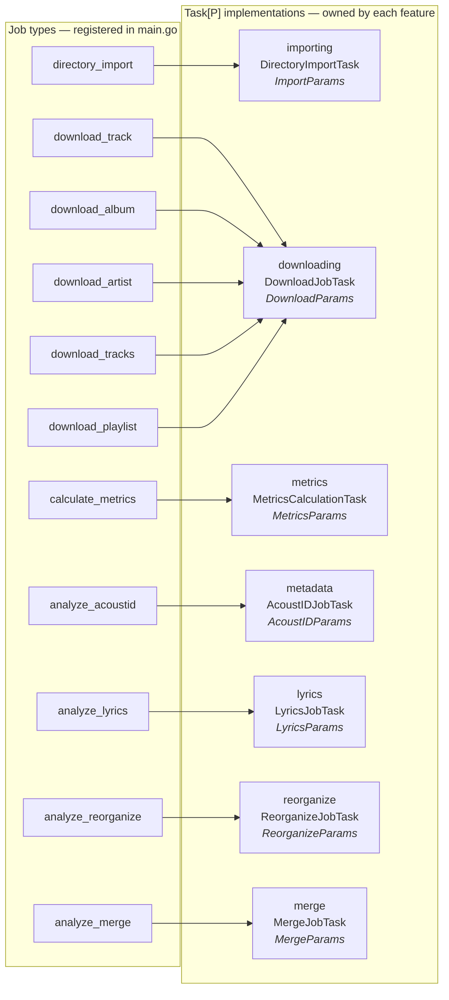
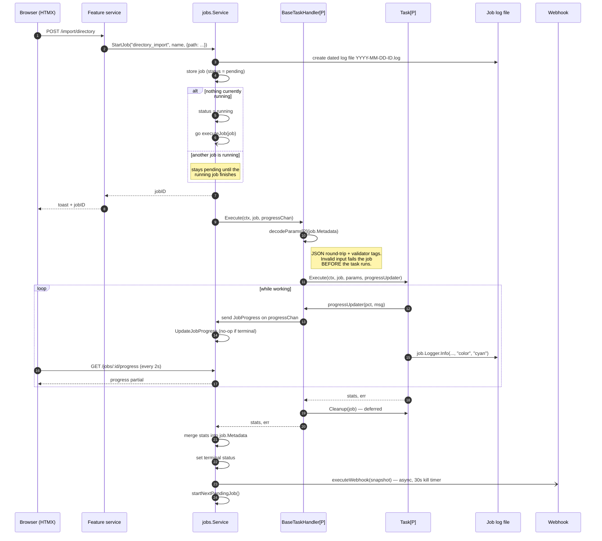
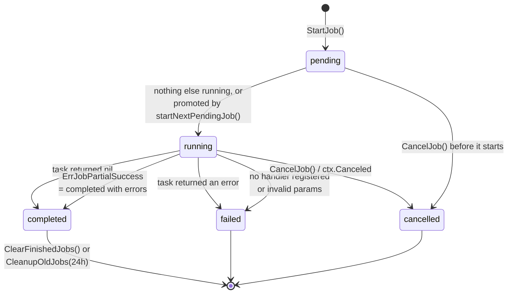
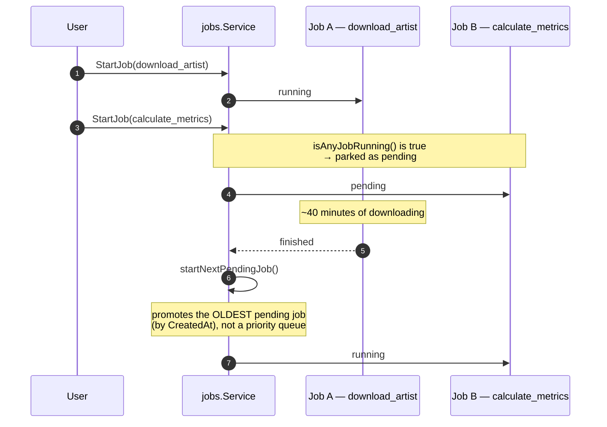
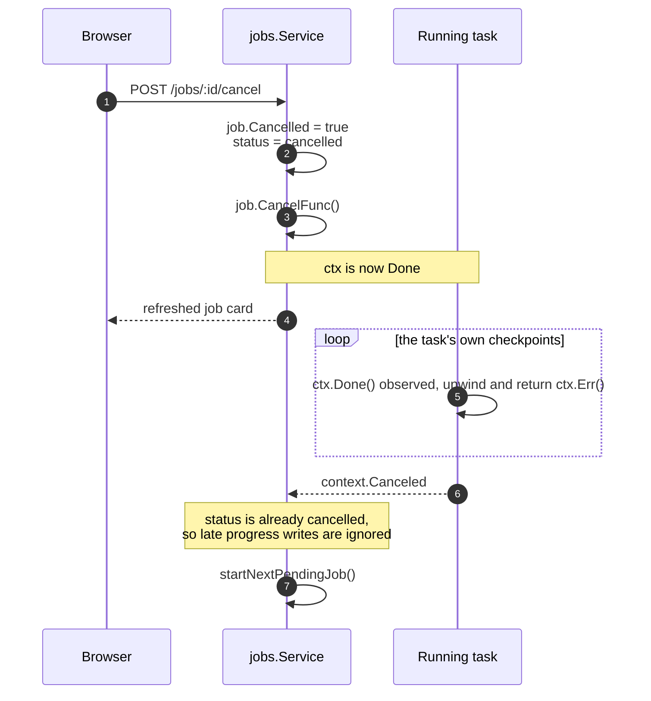
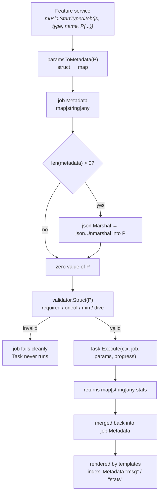

# 3. Background Job Engine

- **Status:** Accepted
- **Date:** 2026-08-24
- **Deciders:** contre95 (maintainer)
- **Supersedes:** —
- **Superseded by:** —

## Context

Almost everything Soulsolid does that matters is slow. Importing a directory
fingerprints and tags hundreds of files. Downloading an album pulls from a
remote provider track by track. Reorganizing rewrites paths across the whole
library. Lyric analysis, AcoustID lookups, metrics recalculation and artist
merges all walk large parts of the collection.

None of that can run inside an HTTP request. It needs to be started, observed,
cancelled, and explained after the fact.

So jobs are not a utility bolted onto the side of Soulsolid — **jobs are the
core mechanism through which Soulsolid touches tracks.** The library (both the
SQLite database and the files on disk) is mutated almost exclusively by job
execution. That framing drives every decision below: the engine is designed
first for safety against a shared mutable library, and only second for
throughput.

The engine lives in `src/features/jobs/`:

```
routes.go     → /jobs route registration
handlers.go   → HTTP layer: start/list/status/progress/logs/cancel + HTMX partials
service.go    → the engine: registry, scheduling, execution, webhooks
log_colors.go → converts log text into color-highlighted HTML
telegram.go   → job commands over the Telegram bot
```

Features depend on the `music.JobService` interface (`src/music/services.go`),
not on the concrete `jobs.Service`, so the engine is swappable in principle and
features do not import each other to schedule work.

Eleven job types are registered in `main.go`: `directory_import`,
`calculate_metrics`, `download_track`, `download_album`, `download_artist`,
`download_tracks`, `download_playlist`, `analyze_acoustid`, `analyze_lyrics`,
`analyze_reorganize`, `analyze_merge`.

## How a job flows

### Which feature owns what

Job *types* and `Task` *implementations* are not one-to-one. Eleven registered
types map onto seven tasks, because all five download variants share a single
task that dispatches on a `Type` discriminator:



That 5-to-1 fan-in is why `DownloadParams.Type` carries a
`validate:"oneof=track album artist tracks playlist"` tag: it is the
discriminator the task switches on, so it must be validated before dispatch.

### The full lifecycle



Two details worth noting because they are easy to get wrong when reading the
code:

- The webhook receives a **snapshot**, never the live `*music.Job`. A running
  task and the service mutate the same struct concurrently, so handing the live
  pointer to a serializer is a data race.
- Progress updates arriving after a job reached a terminal state are dropped, so
  a late channel write cannot resurrect a finished progress bar.

### Status transitions



`completed` is reached by two different routes. A partial import — say 497 of
500 tracks succeeded — lands in `completed`, not `failed`, because the library
genuinely changed. See decision 4.

### Serial scheduling, and what it costs



This is head-of-line blocking, and it is deliberate — see decision 2. A
one-second metrics recalculation waits behind a multi-hour artist download.

## Decision Drivers

- **Safety over throughput.** Jobs share one library — one database and one set
  of files. Correctness under mutation matters more than finishing faster.
- **Observability for a user who wasn't watching.** A job runs for twenty
  minutes unattended; the user needs to see what happened.
- **Cancellability.** Long operations must be stoppable without killing the
  process.
- **A generic engine.** The scheduler must not know what an import or a download
  is; features must be able to add job types without touching the engine.
- **Small maintenance budget.** Every mechanism here is maintained by one
  person, so mechanisms that don't pay for themselves don't get built.

## Decision

### 1. Jobs live in memory only; they do not survive a restart

The service holds `jobs map[string]*music.Job` guarded by a `sync.RWMutex`
(the `jobs.Service` struct). Nothing is written to SQLite. A restart loses all job
records and all in-flight work.

Rationale:

- **Resumable jobs are not worth their cost.** Implementing checkpointing and
  resume for every job type — partial downloads, half-walked directories,
  partially applied reorganizations — is a large, permanently-maintained
  subsystem. The benefit is recovering from an event that mostly doesn't happen.
- **The important case already has a recovery path.** Importing is the job that
  matters most, and it does not need engine-level resume: the import parameters
  are enough to re-run it, and the importer skips what is already in the
  library. Re-running a cut import converges on the same result.
- **Restarts are rare and user-initiated.** This is a self-hosted, single-user
  application. Losing the job list during a deliberate upgrade is acceptable.
- **The durable record is the log file, not a row in a table.** What has
  long-term value is *what the job did*, and that is on disk (see decision 8).

### 2. Exactly one job runs at a time, globally

`StartJob` starts a job immediately only if `isAnyJobRunning()` is false
(`Service.StartJob`); otherwise it stays `pending`. When a job finishes,
`startNextPendingJob()` promotes the **oldest** pending job by `CreatedAt`
(`Service.startNextPendingJob`). There is no worker pool and no per-type concurrency.

Rationale:

- **Every job operates on the same data.** The library database and the music
  files are one shared resource. Serial execution is the crudest and most
  reliable form of mutual exclusion over it.
- **Concrete hazard: download and import overlapping.** A download writes files
  into a directory; an import scans directories and ingests what it finds. Run
  concurrently, an import can pick up a partially-written album and commit
  half-downloaded, wrongly-tagged tracks into the library. Serial execution
  makes that class of bug structurally impossible rather than something to
  defend against case by case.
- **SQLite and disk contention.** Parallel jobs would contend on the single
  writer and on I/O, so much of the theoretical speedup would not materialize
  anyway.
- **External rate limits.** Parallel downloads and metadata lookups would hammer
  providers and risk bans.
- **The decision was made under uncertainty, deliberately conservatively.** When
  the engine was designed, the eventual feature set was not known. Choosing the
  safest scheduling policy meant future features could be added without
  re-auditing the concurrency story for each one. That conservatism is the point,
  not an oversight.
- **Nobody is waiting.** These are batch operations on a personal library.
  Latency is not a user-facing concern.

### 3. Cooperative cancellation via `context`

`executeJob` creates a cancellable context and stores its `CancelFunc` on the
job. `CancelJob` sets `job.Cancelled`, marks the status, and calls the
`CancelFunc`; tasks unwind through their own `ctx.Done()` checks.



Cancellation is therefore **cooperative** — a task that never checks `ctx` runs
to completion regardless, and the UI will show `cancelled` while work continues
in the background. This is accepted: Go offers no safe way to kill a goroutine,
and abrupt termination mid-write is exactly what a library-mutating engine must
avoid.

### 4. Partial success is a distinct outcome

`music.ErrJobPartialSuccess` (raised in `importing/directory_job.go`) causes
the job to land as **completed with errors**, not failed (`Service.executeJob`).

Rationale: importing N tracks is N independent operations. Three unreadable
files out of five hundred is not a failed import — the other 497 tracks are in
the library and the job did its work. Reporting it as `failed` would
misrepresent the state of the library.

### 5. Job input is a typed struct end to end; job output stays an untyped map

Metadata travels as `map[string]any`, because the registry is heterogeneous and
the map is what gets JSON-serialized and indexed by templates. But neither the
caller starting a job nor the task running it ever handles that map directly —
the same parameter struct sits at both ends of the round trip:



The struct fields *are* the schema, so there is no separate key declaration to
drift out of sync with what the task reads. Validation covers presence, type and
constraints, and it fails before any library mutation happens.

**Callers are typed too.** `music.StartTypedJob` is a generic free function that
marshals a parameter struct into the metadata map, so a misspelled or
wrongly-typed field is a compile error at the call site rather than a validation
failure once the job runs:

```go
music.StartTypedJob(s.jobService, "directory_import", "Directory Import",
    ImportParams{Path: pathToImport})
```

It is a free function rather than a method because **Go does not permit type
parameters on methods**. `StartJob[P]` cannot exist on the `music.JobService`
interface, and deleting that interface to make it generic would put every
feature back to importing `src/features/jobs`, violating ADR 0002. A generic
function taking the interface as its first argument sidesteps both problems.

The one caller that stays untyped is `POST /jobs/start/:type`, which accepts an
arbitrary job-type string at runtime and passes `nil` metadata. That is also how
the dashboard triggers `calculate_metrics`, and it is why param-less tasks
declare an empty struct with no required fields — nil metadata must decode
successfully for them.

The JSON round-trip is deliberate rather than merely convenient: it normalizes
values that would otherwise arrive in several shapes (`[]any` vs `[]string`,
`float64` vs `int`). Two hand-rolled coercion helpers existed purely to paper
over this and were deleted when the typed decode landed.

**The output direction stays untyped on purpose.** Tasks return
`map[string]any` stats that are merged into `job.Metadata`, because
`views/jobs/job_card_footer.html` indexes it dynamically (`index $job.Metadata
"msg"`, `"stats"`, `"moved"`) and the webhook reads `Metadata["msg"]`. Typing
that direction would mean restructuring templates for far less benefit. The map
is the wire and display format; the struct is the execution format.

### 6. `Task[P]` / `TaskHandler` split via `BaseTaskHandler[P]`

Two interfaces exist:

- `TaskHandler` — `Execute(ctx, job, progressChan)` + `Cancel(jobID)`.
  Non-generic. This is what the service stores and calls.
- `Task[P]` — `Execute(ctx, job, params P, progressUpdater)` + `Cleanup(job)`.
  Generic over the parameter struct. This is what features implement.

`BaseTaskHandler[P]` adapts one to the other: it decodes and validates `P`,
wraps the progress channel into a plain `func(int, string)` callback so tasks
never touch channels, runs the task, and guarantees `Cleanup` via `defer`.

**Why the type parameter lives on the wrapper and not on `Job`.** The obvious
design — `Job[P]` — does not compile. The service holds heterogeneous jobs in
one registry:

```go
jobs     map[string]*music.Job
handlers map[string]TaskHandler
```

Go has no existential types, so there is no `map[string]*Job[?]` able to hold a
`Job[ImportParams]` alongside a `Job[DownloadParams]`. Making `Job` generic
would force `Service[P]`, which defeats the point of a generic engine.

Putting `P` on the wrapper instead erases it at the registration boundary:

```go
func NewBaseTaskHandler[P any](task Task[P]) TaskHandler
```

`P` is inferred from the task's method signature and disappears into the
non-generic `TaskHandler` return, so the registry stays homogeneous while each
task gets a fully typed payload. Registration is unchanged by the type
parameter:

```go
jobService.RegisterHandler("directory_import", jobs.NewBaseTaskHandler(directoryImportTask))
```

The benefit is that cross-cutting concerns happen once and a feature author
cannot forget them. That is now genuinely true for decoding, validation and
progress adaptation. `Cancel` and `Cleanup` still are not earning their keep —
see Open Questions.

### 7. Per-job log files on disk, with inline color hints

When `jobs.log` is enabled, each job gets a dated file
`YYYY-MM-DD-<id>.log` and an attached `slog` text logger; when disabled it gets
an `io.Discard` logger so task code never needs a nil check
(`Service.StartJob`). `log_colors.go` re-parses that text, classifying lines by
level and by `color=...` hints the features embed, and renders colored HTML for
the UI.

Rationale:

- **Logs outlive the process.** Since jobs themselves are not persisted
  (decision 1), the on-disk log is the only durable account of what happened.
  These two decisions are deliberately coupled.
- **Auditing what went *right*, not just what went wrong.** This is the primary
  motivation. Soulsolid can be configured with permissive settings that let it
  move, retag and reorganize files without asking for confirmation each time. A
  user who has opted into that needs to be able to go back and inspect exactly
  which actions were taken on their behalf. The job log is that record.
- **Directly inspectable.** The log directory is a mounted volume; users can
  `grep` it without the UI running.
- **Bounded memory.** A large import produces a lot of output. Streaming it to a
  file keeps it out of RAM.
- **Colors are an acknowledged hack.** Embedding `color=` hints in log text and
  parsing them back out is not a structured logging design. It is a cheap way to
  get a readable console-like view, and it is called what it is.

### 8. Progress is delivered by HTMX polling, not SSE or WebSockets

The UI polls: `every 600ms` for live log tails, `every 2s` for job cards,
`every 5s` for the global status indicator. Progress endpoints emit
`HX-Trigger: done` when a job reaches a terminal state so the client can stop.

Rationale:

- **It fits the model chosen in ADR 0001.** `hx-trigger="every 2s"` is one HTML
  attribute. SSE would mean connection lifecycle, reconnection and per-client
  server state — reintroducing exactly the client-side complexity that ADR 0001
  rejected.
- **Serial execution makes polling cheap.** At most one job runs and typically
  one person is watching. The load is negligible at this scale.
- **Disconnects cost nothing.** Closing a tab, sleeping a laptop or losing wifi
  requires no reconnect logic; the next poll simply succeeds.

Internally, progress flows over a buffered channel (capacity 10) into
`UpdateJobProgress`, which ignores updates once a job is terminal
(`Service.UpdateJobProgress`) so a late write cannot resurrect a finished progress bar.

### 9. Concurrency discipline: snapshots, never live jobs

`snapshotJob` (`snapshotJob`) returns a copy with a cloned `Metadata` map.
`GetJob`/`GetJobs` return snapshots, and the webhook is fired against a snapshot
rather than the live object. Tasks must rename a job through `SetJobName` rather
than writing `job.Name`, so the write happens under the service lock.

This exists because a running task and the service mutate the same `*music.Job`
concurrently; handing the live pointer to a JSON serializer is a data race.

### 10. Webhooks are deploy-time shell commands, not HTTP calls

On completion, if enabled and the job type matches, a `text/template` command is
rendered with `{{.Name}}`, `{{.Type}}`, `{{.Status}}`, `{{.Message}}`,
`{{.Duration}}` and run via `/bin/sh -c` in its own process group with a 30s
SIGKILL timer (`Service.executeWebhookCommand`).

Rationale:

- **The actual use case is telling other media servers to rescan.** Soulsolid is
  not usually the endpoint — it manages a library that Jellyfin, Emby, Navidrome
  or Plex then serves. The job that matters is: import finished, go refresh.
- **Building an adapter per media server is a maintenance trap.** Supporting two
  or three providers natively would mean tracking their API changes forever, and
  would implicitly narrow Soulsolid's audience to users of those specific
  servers. A shell command supports every one of them, plus ntfy, plus a user's
  own script, at zero ongoing cost.
- **The shell is the universal integration surface.** `curl` already exists and
  already speaks every API worth calling.

**Security, stated plainly:** this is configuration-driven arbitrary command
execution inside the container. That is accepted, for two specific reasons:

1. **It cannot be set at runtime.** The webhook command is only readable from
   the config file at deploy time. The config update handler deliberately
   carries `Webhooks` over from the existing config and never reads it from the
   submitted form (`src/features/config/handlers.go`, in the config update handler) — the same treatment
   given to server settings. Compromising the web UI does not grant command
   execution.
2. **The threat model.** Soulsolid is a personal management tool for a niche
   audience. It is not intended to be internet-exposed or multi-tenant, and
   whoever writes the config already controls the container.

Both reasons are conditional. If Soulsolid ever grows shared or exposed
deployments, this decision must be revisited.

## Alternatives Considered

| Alternative | Why not |
| --- | --- |
| **External queue (Redis, NATS, RabbitMQ)** | Adds a mandatory second service, destroying the zero-config single-container property from ADR 0001. Massive overkill for one user running one job at a time. |
| **Persisting jobs to SQLite** | Would survive restarts, but requires schema and migrations for a fast-changing, inherently transient concern — and resumability, the actual reason to want it, would still need per-task work. Log files cover the audit need at a fraction of the cost. |
| **Worker pool / per-type concurrency** | Real throughput gains for independent work, but requires reasoning about which job types can safely overlap on a shared library. That analysis was not possible when the roadmap was unknown, and the download-vs-import hazard shows the failure mode is silent data corruption. Deferred, not rejected forever. |
| **`os/exec` per job (process isolation)** | True cancellation via SIGKILL and memory isolation, but loses in-process access to services and makes progress reporting an IPC problem. |
| **SSE / WebSocket progress** | Lower latency and no polling overhead, but adds connection state on both ends and reconnect logic, for a UI where 2-second granularity is entirely adequate. |
| **`Job[P]` — generics on the job itself** | The intuitive shape, but impossible: Go lacks existential types, so a single `map[string]*Job[?]` cannot hold different `P`. Would force `Service[P]` and destroy the generic registry. Solved instead by putting `P` on the handler wrapper, where it is erased at registration. |
| **`mapstructure` for decoding params** | Purpose-built for map→struct, but a new dependency. JSON round-trip is stdlib, reuses the struct tags already needed for serialization, and normalizes `[]any`/`float64` the same way. |
| **Native webhook integrations (Jellyfin/Navidrome/Plex APIs)** | Better UX and no shell exposure, but an unbounded, permanent maintenance obligation that also narrows the supported ecosystem. |
| **HTTP-POST-only webhooks** | Removes command execution as a risk, but cannot express "run this local script" and still requires per-service payload shaping. |

## Consequences

### Positive

- A running job has exclusive access to the library. Whole classes of concurrent
  mutation bugs cannot occur.
- Job behavior is trivially reproducible and debuggable: one timeline, one log,
  one thing happening.
- Adding a new job type is a small, local change — implement `Task`, register it
  in `main.go`. The engine never changes.
- Zero infrastructure: no broker, no worker process, no extra container.
- Users have a durable, greppable audit trail of every action taken on their
  files, including actions taken without explicit per-item confirmation.
- The UI is resilient: polling recovers from any disconnection with no code.

### Negative / accepted costs

- **Head-of-line blocking.** One long download or import blocks everything.
  A ten-hour artist download stalls a one-second metrics recalculation.
- **All job state is lost on restart,** including the queue. Pending jobs are not
  re-queued; the user must start them again.
- **In-flight work is truncated on restart,** and only importing has a clean
  re-run story. A cut reorganize or download may leave partial state on disk.
- **One untyped entry point remains.** Every feature-initiated job goes through
  `music.StartTypedJob` and is checked at compile time, but `POST
  /jobs/start/:type` takes a job-type string from the URL and cannot be. Bad
  input there is caught by validation at run time — cleanly, but not by the
  compiler.
- **Two JSON round trips per job start** (struct → map on the way in, map →
  struct on the way out). Irrelevant for jobs measured in minutes; it would not
  be for a high-frequency queue.
- **Cancellation is only as good as the task.** A task that ignores `ctx` runs to
  completion regardless, while the UI reports `cancelled`.
- **Webhook config is arbitrary command execution,** mitigated but not eliminated
  by being deploy-time-only.
- **Job memory grows until cleaned.** `ClearFinishedJobs` and
  `CleanupOldJobs(maxAge)` must be invoked; terminal jobs otherwise accumulate
  for the process lifetime.

## Open Questions

1. **`Cancel` and `Cleanup` are dead weight — should they be removed?**
   The typed-params work resolved the validation half of this question by
   deleting `MetadataKeys()` outright. Two vestigial members remain:
   - `TaskHandler.Cancel` is **entirely dead**. `BaseTaskHandler.Cancel`
     unconditionally returns `nil`, and since `BaseTaskHandler[P]` is the only
     implementation of `TaskHandler`, the `handler.Cancel(jobID)` call in
     `CancelJob` is always a no-op. Real cancellation is 100% context-based.
   - `Task.Cleanup` is **implemented seven times and does nothing seven times** —
     every implementation is a bare `return nil` or a `slog.Debug` plus
     `return nil`, and `downloading/download_job.go` still carries a `TODO` for
     cleanup that was never written.

   No feature has ever implemented `TaskHandler` directly, so the escape hatch
   the two-interface split provides remains unused. Collapsing to a single
   interface and deleting `Cancel` is viable; `Cleanup` should either get a real
   caller (temp-file removal on the download path is the obvious candidate) or
   go. Deferred rather than decided here.

2. **Per-type concurrency.** Some pairs are provably safe to overlap (e.g.
   `calculate_metrics` is read-mostly). A capability declaration on `Task` —
   "this job writes files", "this job writes the DB" — could let the scheduler
   run non-conflicting jobs in parallel while preserving today's guarantees for
   conflicting ones.

3. **Queue stall on unregistered job type.** When `executeJob` finds no
   registered handler it marks the job failed and returns
   (`Service.executeJob`) **without calling `startNextPendingJob()`**. Any
   already-pending jobs are left pending until some later `StartJob` call
   happens to find nothing running. This looks like a defect rather than a
   decision.

4. **Unlocked handler-map read.** `executeJob` reads `s.handlers` without holding
   `s.mu` (`Service.executeJob`), while `RegisterHandler` writes it under the lock.
   This is safe today only because all registration happens in `main.go` before
   the server accepts requests. If handler registration ever becomes dynamic —
   which the plugin system in ADR 0001's open questions could require — this
   becomes a real data race.

5. **Automatic cleanup.** Whether `CleanupOldJobs` should run on a timer rather
   than depending on an endpoint being called.

## Related

- ADR 0001 — Technology stack (Go concurrency, SQLite single-writer, HTMX polling)
- ADR 0002 — Vertical slice architecture
- `docs/features/jobs.md` — feature documentation for the engine
- `docs/features/importing.md`, `downloading.md`, `reorganize.md`, `lyrics.md`,
  `metrics.md`, `metadata.md` — features that run their work as jobs
- `docs/features/config.md` — the `jobs` config block
